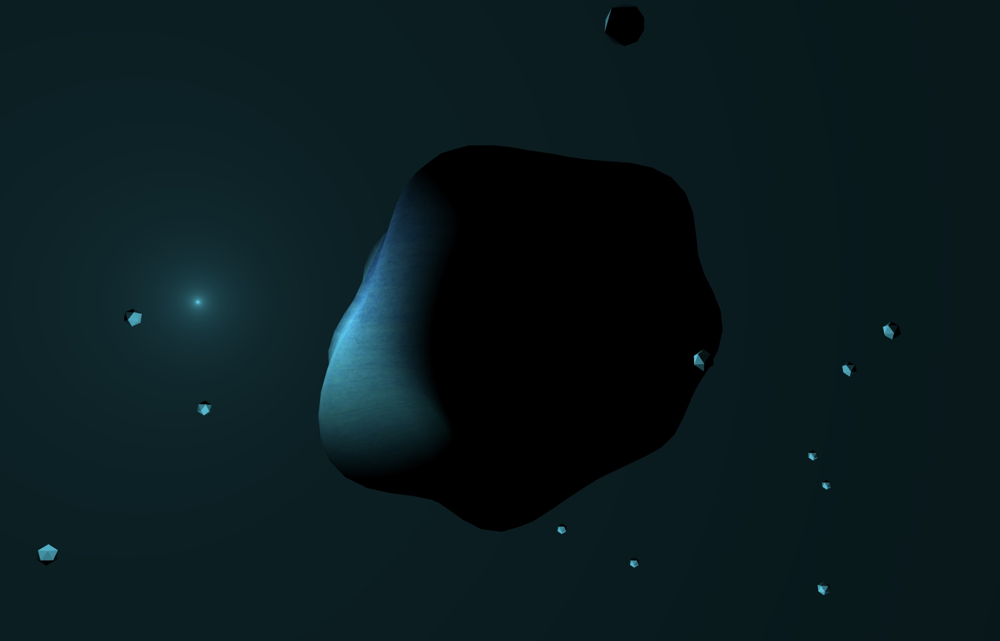

  

## About The Project
A demo of globe flights with Threejs.  
The demo aims to load many objects and ensure basic interaction.  

I have tried the following methods:  
1. handle raw data with worker.  
2. use requestIdleCallback to add mesh progressive.  
3. keep balance between loading meshes and rendering by rendering ondemand.  

The performance is still bad... My computer is crashed when the number of meshes is up to near 70,000... But it is still fun at the beginning watching flights come out... then crashed.

## Get Started
#### Run Online   
[https://globe-flights-visualization.netlify.app](https://globe-flights-visualization.netlify.app) 

## License
This project is licensed under 

## Contact
* Email:[eric199002@icloud.com](eric199002@icloud.com)
* Twitter:[https://twitter.com/nikoniko600](https://twitter.com/nikoniko600)
* Repo:[https://github.com/Eric-Schecter/globe-flights-visualization](https://github.com/Eric-Schecter/globe-flights-visualization)
* App:[https://globe-flights-visualization.netlify.app](https://globe-flights-visualization.netlify.app) 